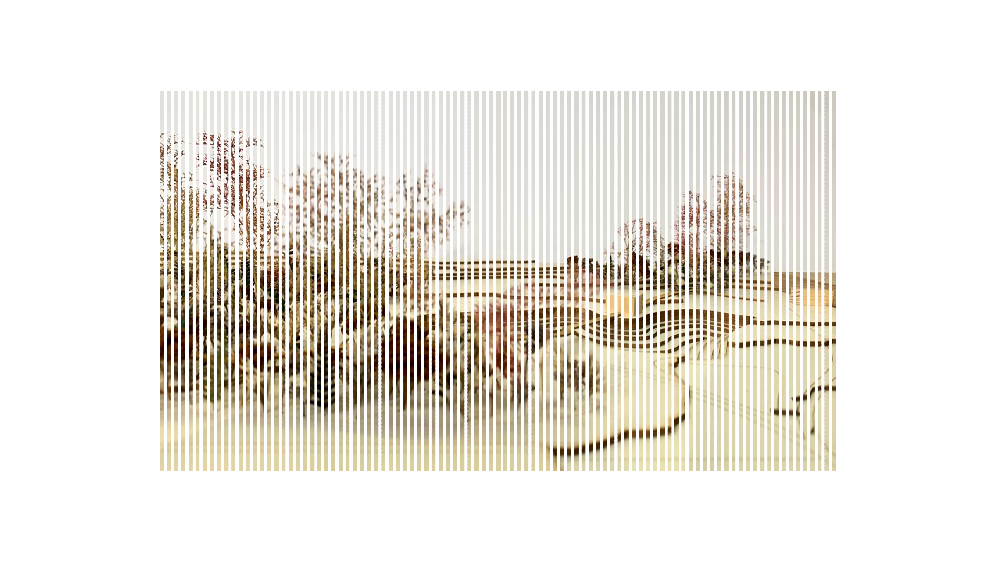

<!DOCTYPE html>
<html lang="en">

<head>
    <meta charset="UTF-8">
    <meta name="viewport" content="width=device-width, initial-scale=1.0">
    <title>Tine Kierulf - Architect MNAL</title>
    <link rel="stylesheet" href="https://cdnjs.cloudflare.com/ajax/libs/font-awesome/6.0.0-beta3/css/all.min.css">
    
</head>

<body>
    <section class="intro-section">
        

            MSc Architect
            Tine Kierulf
            MNAL
        

        

            <a href="#projects">Projects</a>
            <a href="#education">Education</a>
            <a href="#experience">Experience</a>
            <a href="#art">Art</a>
            <a href="#contact">Contact</a>
        

    </section>

    <section id="projects" class="section">
        <h2>Selected Projects</h2>
        

            

                
                

                    <h3 class="project-title">PULS Bathhouse</h3>
                    

                        
A pro-bono project in Åsgårdstrand, inspired by the area's cultural history and evening sky. The bathhouse seeks to connect the community with nature and provide a tranquil, cultural space.

                        
                    

                

            

            

                
                

                    <h3 class="project-title">Master Thesis</h3>
                    

                        
Reimagining the former Munch Museum in Oslo as a biophilic public space, integrating nature and architecture to revitalize the community.

                        
                    

                

            

            

                
                

                    <h3 class="project-title">Grounded</h3>
                    

                        
An underground mindfulness space in central Oslo, restoring part of a forgotten river and creating a contemplative atmosphere for urban dwellers.

                        
                    

                

            

            

                
                

                    <h3 class="project-title">A New European Bauhaus</h3>
                    

                        
A theoretical project proposing a sustainable design for a European University focused on earth-based materials and environmentally conscious teaching practices.

                        
                    

                

            

        

    </section>

    <section id="education" class="section">
        <h2>Education</h2>
        

            

                

                    <h3 class="item-title">MSc Architecture (RIBA II), University of Liechtenstein</h3>
                    
RIBA 1 and 2 accreditation. Thesis focused on integrating biophilic design and environmental psychological patterns in architecture.

                

                

                    <h3 class="item-title">BSc Building Design, University of Agder</h3>
                    
Civil Engineering degree with electives in Architecture, Urban Planning and Development, Project Management, and Static Calculations.

                

                

                    <h3 class="item-title">Philosophy, NTNU</h3>
                    
One-year study in philosophy focusing on aesthetics and ethics.

                

            

        

    </section>

    <section id="experience" class="section">
        <h2>Experience</h2>
        

            

                

                    <h3 class="item-title">Architect Tine Kierulf</h3>
                    
Self-employed architecture and design business. Working on the Badehuset PULS project and continuous projects in interior design, gardens, pergolas, art, and consultation on other bathhouse projects.

                

                

                    <h3 class="item-title">SEIAA Impact Academy</h3>
                    
Participated in an international workshop on mediating constraints in building and architecture.

                

                

                    <h3 class="item-title">Speaker at NEB Conference for the European Commission</h3>
                    
Invited by honorary UNESCO professor Anna Heringer as a guest lecturer at a conference organized by the European Commission, focusing on clay architecture.

                

            

        

    </section>

    <section id="art" class="section">
        <h2>Art Portfolio</h2>
        
I enjoy hand drawing and watercolor painting, featuring both landscape and urban motifs.

        

            

                
            

            

                
            

            

                
            

            

                
            

        

    </section>

    <section id="contact" class="section">
        <h2>Contact</h2>
        

            
Email: <a href="mailto:tine.kierulf@hotmail.com">tine.kierulf@hotmail.com</a>

            
Phone: +47 91 68 03 18

            
Location: Oslo, Norway

        

    </section>

    <footer class="footer">
        
&copy; 2024 Tine Kierulf. All rights reserved.

        

            <a href="#" title="LinkedIn"><i class="fab fa-linkedin"></i></a>
            <a href="#" title="Instagram"><i class="fab fa-instagram"></i></a>
        

    </footer>

  <!DOCTYPE html>
<html lang="en">
<head>
    <!-- ... -->
    
</head>
<body>
    <!-- ... -->
    <section id="projects" class="section">
        <!-- ... -->
        

            

                <!-- ... -->
                

                    <!-- ... -->
                

            

            <!-- ... -->
        

    </section>
    <!-- ... -->
    <footer class="footer">
        <!-- ... -->
    </footer>

    
</body>
</html>
        document.addEventListener('DOMContentLoaded', function () {
            const sections = document.querySelectorAll('.section');

            const observer = new IntersectionObserver((entries) => {
                entries.forEach(entry => {
                    if (entry.isIntersecting) {
                        entry.target.classList.add('scroll-active');
                    }
                });
            }, { threshold: 0.1 });

            sections.forEach(section => {
                observer.observe(section);
            });

            // Toggle project details on click
            const projects
.project-card {
    /* ... */
}

.project-card.open .project-info {
    display: block;
}

.project-card:not(.open) .project-info {
    display: none;
}
